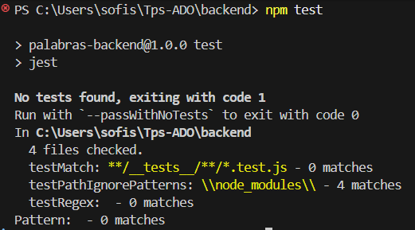
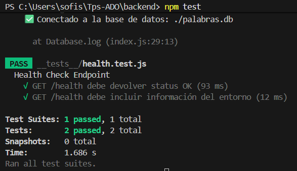
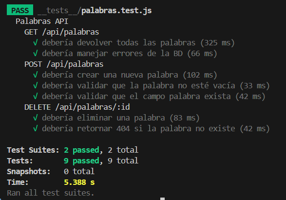
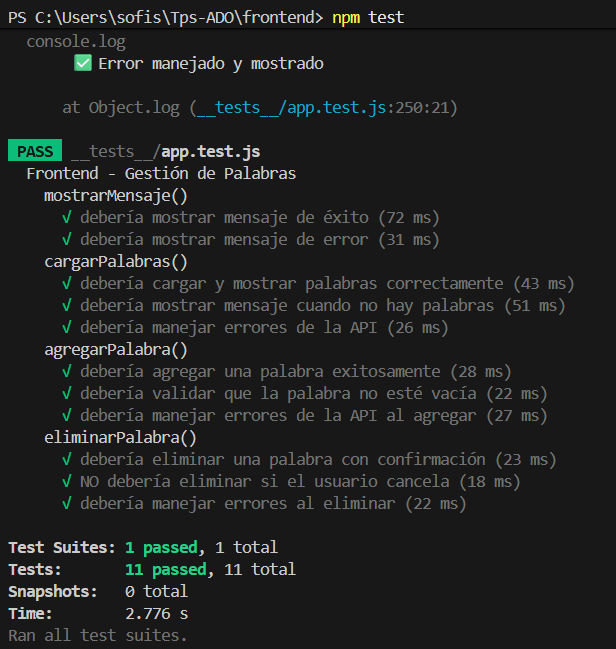

# TP 6: Tests Unitarios

## 1. Frameworks de Testing Elegidos y Justificación

### Backend

#### Framework Principal: Jest

- **Más popular para Node.js**: Amplia comunidad y documentación
- **Fácil configuración**: Setup mínimo requerido
-**Todo integrado**: No requiere múltiples paquetes adicionales
- **Compatibilidad perfecta con Express**: Diseñado para el ecosistema Node.js

#### Librería Complementaria: Supertest

- Permite testear APIs HTTP sin necesidad de levantar el servidor
- Simplifica las pruebas de endpoints
- Integración nativa con Express

### Frontend

#### Framework: Jest + Extensiones

- **jest-fetch-mock**: Para mockear llamadas fetch a la API
- **jest-environment-jsdom**: Simula el DOM del navegador en Node.js
- **Consistencia**: Mismo framework que backend, facilitando la mantenibilidad

### Instalación

```bash
# Backend
npm install --save-dev jest supertest

# Frontend
npm install --save-dev jest jest-fetch-mock jest-environment-jsdom
```

> **Nota**: Se usa `--save-dev` porque las herramientas de testing solo se ejecutan en desarrollo, no en producción, quedando en `devDependencies`.



---

## 2. Estrategia de Mocking Implementada

### Backend: Mocking de Base de Datos

#### Problemas identificados

-  Los tests modificaban datos reales
-  Tests lentos por operaciones I/O
-  Dependencia de la existencia de la BD
-  Acoplamiento entre backend y base de datos

#### Solución implementada

- **Separación de responsabilidades**: Se desacopló la conexión de la base de datos del backend
- **Mock completo de la BD**: Se crearon mocks de todas las operaciones de base de datos
- **Tests aislados**: Cada test puede ejecutarse independientemente sin afectar datos reales

### Frontend: Mocking de API y DOM

#### Estrategias aplicadas

1. **Mock de Fetch API**
    - Uso de `jest-fetch-mock` para simular respuestas HTTP
    - Control sobre respuestas exitosas y errores
    - Sin dependencia del backend real

2. **Mock de DOM**
    - `jsdom` simula el entorno del navegador
    - Permite testear manipulación del DOM sin navegador real

3. **Mock de CSS**
    - Setup específico para ignorar imports de CSS en tests
    - Evita errores de módulos no JS durante las pruebas

---

## 3. Casos de Prueba Relevantes Explicados

### Backend

#### Suite 1: Health Check (`health.test.js`)

**Propósito**: Verificar que el servidor responde correctamente

**2 Tests implementados**:

- ✓ `/health` debe devolver status OK *(93 ms)*
  - Verifica que el endpoint responde con código 200
  - Confirma que el servidor está operativo

- ✓ `/health` debe incluir información del entorno *(12 ms)*
  - Valida que la respuesta contiene metadata del sistema
  - Verifica estructura de la respuesta

> **Relevancia**: Estos tests son críticos para monitoring y health checks en producción.



#### Suite 2: Palabras (`palabras.test.js`)

**Propósito**: Validar CRUD completo de palabras

**7 Tests implementados**:

- Tests de **GET**: Recuperación de palabras (lista completa, por ID)
- Tests de **POST**: Creación de nuevas palabras
- Tests de **DELETE**: Eliminación de palabras
- Tests de **validación**: Manejo de errores y casos edge



**Cobertura por capas**:

| Capa | Validaciones |
|------|--------------|
| **Servicios** | • Capa de acceso a datos<br>• Operaciones CRUD con la BD mockeada<br>• Validación de queries y respuestas del repositorio |
| **Controladores** | • Endpoints HTTP completos<br>• Validación de códigos de estado (200, 201, 404, 400, etc.)<br>• Formato de requests y responses<br>• Manejo de errores HTTP |
| **Lógica de Negocio** | • Validaciones de datos (palabras vacías, duplicadas)<br>• Transformaciones de datos<br>• Reglas de negocio independientes de la presentación |

### Frontend

#### Suite 1: App (`app.test.js`)

**11 Tests implementados**:

##### 1. Tests de Componentes

**Propósito**: Verificar renderizado e interacción de la UI

**Casos cubiertos**:
- Renderizado correcto de elementos del DOM
- Interacción del usuario (clicks, inputs)
- Actualización reactiva de la UI
- Estados de carga y error

> **Ejemplo relevante**: mostrarMensaje() - Verifican renderizado e interacción de la UI:
✓ debería mostrar mensaje de éxito
✓ debería mostrar mensaje de error

#### 2. Tests de Servicios

**Propósito**: Validar comunicación con el backend

**Casos cubiertos**:
- Llamadas fetch correctas (URL, método, headers)
- Parsing de respuestas JSON
- Manejo de errores HTTP (404, 500)
- Timeout y errores de red

> **Ejemplo relevante**: cargarPalabras() - Validación de comunicación con el backend:

✓ debería cargar y mostrar palabras correctamente (llama al fetch)
✓ debería mostrar mensaje cuando no hay palabras
✓ debería manejar errores de la API

#### 3. Tests de Utilidades

**Propósito**: Validar funciones auxiliares

**Casos cubiertos**:
- Funciones de formateo
- Validaciones de datos
- Funciones puras sin side effects

> **Ejemplo relevante**: eliminarPalabra() - Funciones auxiliares:

✓ debería eliminar una palabra con confirmación
✓ NO debería eliminar si el usuario cancela
✓ debería manejar errores al eliminar



---

## 4. Métricas y Resultados

| Métrica | Resultado |
|---------|-----------|
| **Backend** | Tests completos de health check + CRUD completo |
| **Frontend** | Cobertura de componentes, servicios y utilidades |
| **Velocidad** | Tests rápidos gracias al mocking (promedio < 100ms por test) |
| **Confiabilidad** | Tests aislados y reproducibles |
